```mermaid
sequenceDiagram
    participant User
    participant Frontend
    participant Backend
    participant Database
    participant AI

    User->>Frontend: 1. Chọn study mode
    User->>Frontend: 2. Bật camera
    User->>Frontend:  3. Nhấn "Start"
    
    Frontend->>Backend: 4. POST /api/focus/sessions
    Backend->>Database: 5. Create session record
    Database-->>Backend: 6. session_id
    Backend-->>Frontend: 7. Session created
    
    Frontend->>Backend: 8. WebSocket connect
    Backend->>AI: 9. Load AI models
    Backend-->>Frontend: 10. Connected
    
    Frontend->>Backend: 11. Send frames
    Backend->>AI: 12. Process frames
    AI-->>Backend: 13. Detection results
    Backend-->>Frontend:  14. Real-time feedback
```

```mermaid
sequenceDiagram
    participant User
    participant Frontend
    participant Backend
    participant Database

    User->>Frontend: 1. Nhấn "Stop" / Timer complete
    Frontend->>Backend: 2. POST /sessions/: id/end
    
    Backend->>Backend: 3. Calculate final metrics
    Note over Backend: - ended_at = now()<br/>- duration = end - start<br/>- final_score = current_score<br/>- average_score = (initial + final) / 2
    
    Backend->>Database: 4. Update session
    Note over Database: status = "completed"
    Database-->>Backend:  5. Confirmed
    
    Backend->>Frontend: 6. Close WebSocket
    Backend-->>Frontend: 7. Session summary
    
    Frontend->>User: 8. Display results
    Note over User,Frontend: - Total duration<br/>- Final score<br/>- Violations breakdown<br/>- Focus percentage
```

# 📚 AI Learning Companion - Use Cases và Cơ chế Phát hiện

> **Project:** AI Learning Companion  
> **Version:** 1.0.0  
> **Last Updated:** January 2026  
> **Repository:** [mtreeno1/AI-Learning-Companion-BE](https://github.com/mtreeno1/AI-Learning-Companion-BE)  
> **Status:** ✅ Core Features Complete | 🚧 Dashboard In Progress

---

## 📋 Mục lục

- [1. Tổng quan Hệ thống](#1-tổng-quan-hệ-thống)
  - [1.1 Giới thiệu](#11-giới-thiệu)
  - [1.2 Công nghệ sử dụng](#12-công-nghệ-sử-dụng)
- [2. Use Cases (Ca sử dụng)](#2-use-cases-ca-sử-dụng)
  - [UC-01:  Tạo Phiên Học Mới](#uc-01-tạo-phiên-học-mới)
  - [UC-02: Giám sát Thời gian Thực](#uc-02-giám-sát-thời-gian-thực)
  - [UC-03: Ph��t hiện và Cảnh báo Vi phạm](#uc-03-phát-hiện-và-cảnh-báo-vi-phạm)
  - [UC-04: Kết thúc Phiên Học](#uc-04-kết-thúc-phiên-học)
  - [UC-05: Xem Lịch sử Phiên Học](#uc-05-xem-lịch-sử-phiên-học-in-progress)
  - [UC-06: Dashboard Analytics](#uc-06-dashboard-analytics-in-progress)
- [3. Cơ chế AI Detection](#3-cơ-chế-ai-detection)
  - [3.1 Pipeline Tổng quan](#31-pipeline-tổng-quan)
  - [3.2 Person Detection](#32-person-detection)
  - [3.3 Phone Detection](#33-phone-detection)
  - [3.4 Focus Assessment](#34-focus-assessment)
- [4. Hệ thống Tính điểm](#4-hệ-thống-tính-điểm)
  - [4.1 Cơ chế Scoring](#41-cơ-chế-scoring)
  - [4.2 Penalty System](#42-penalty-system-hệ-thống-phạt-điểm)
  - [4.3 Recovery System](#43-recovery-system-hệ-thống-hồi-phục-điểm)
  - [4.4 Ví dụ Tính điểm](#44-ví-dụ-tính-điểm)
- [5. Hệ thống Phát hiện Vi phạm](#5-hệ-thống-phát-hiện-vi-phạm)
  - [5.1 Event-Based Detection](#51-event-based-detection)
  - [5.2 Violation States](#52-violation-states)
  - [5.3 Consecutive Violations Tracking](#53-consecutive-violations-tracking)
  - [5.4 Violation Metrics](#54-violation-metrics)
- [6. Hệ thống Cảnh báo](#6-hệ-thống-cảnh-báo)
  - [6.1 Alert Levels](#61-alert-levels)
  - [6.2 Alert Triggers](#62-alert-triggers)
  - [6.3 Alert Display](#63-alert-display-frontend)
- [7. Kiến trúc Kỹ thuật](#7-kiến-trúc-kỹ-thuật)
  - [7.1 System Architecture](#71-system-architecture)
  - [7.2 WebSocket Flow](#72-websocket-flow)
  - [7.3 Database Schema](#73-database-schema)
  - [7.4 API Endpoints](#74-api-endpoints)
  - [7.5 Performance Optimization](#75-performance-optimization)
- [8. Tính năng Đang phát triển](#8-tính-năng-đang-phát-triển)
  - [8.1 Dashboard Analytics](#81-dashboard-analytics-)
  - [8.2 Session History](#82-session-history-)
  - [8.3 Gamification](#83-gamification-)
  - [8.4 AI Improvements](#84-ai-improvements-)
  - [8.5 Export & Reports](#85-export--reports-)
- [9. Kết luận](#9-kết-luận)

---

## 1. Tổng quan Hệ thống

### 1.1 Giới thiệu

**AI Learning Companion** là hệ thống hỗ trợ học tập thông minh sử dụng **Computer Vision** và **Deep Learning** để: 

- 🎯 Giám sát thời gian thực độ tập trung của người học
- ⚠️ Phát hiện và cảnh báo các hành vi gây mất tập trung
- 📊 Đánh giá và chấm điểm phiên học dựa trên mức độ tập trung
- 📈 Cung cấp thống kê và phân tích chi tiết

### 1.2 Công nghệ sử dụng

#### Backend Stack
| Technology | Purpose | Version |
|-----------|---------|---------|
| FastAPI | Web Framework | 0.104+ |
| WebSocket | Real-time Communication | - |
| YOLO | Object Detection (Phone) | v8 |
| MediaPipe | Face Detection | Latest |
| PostgreSQL | Database | 14+ |
| SQLAlchemy | ORM | 2.0+ |
| Python | Language | 3.11+ |

#### Frontend Stack
| Technology | Purpose | Version |
|-----------|---------|---------|
| Next.js | React Framework | 14+ |
| TypeScript | Type Safety | 5.0+ |
| TailwindCSS | Styling | 3.0+ |
| WebSocket API | Real-time Connection | - |

---

## 2. Use Cases (Ca sử dụng)

### UC-01: Tạo Phiên Học Mới

**Actor:** Người học (Student)

**Mô tả:** Người học tạo phiên học mới với timer và camera tracking

**Preconditions:**
- ✅ Người dùng đã đăng nhập
- ✅ Thiết bị có camera
- ✅ Đã cấp quyền truy cập camera

**Main Flow:**



**Steps:**

1. Người dùng chọn study mode: 
   - 🍅 Pomodoro (25 phút học - 5 phút nghỉ)
   - ⏱️ 52-17 (52 phút học - 17 phút nghỉ)
   - ⚙️ Custom (tùy chỉnh)

2. Người dùng bật camera hoặc upload video

3. Người dùng nhấn nút **"Start"** trên timer

4. Hệ thống tự động: 
   - ✅ Tạo session mới trong database
   - ✅ Khởi tạo WebSocket connection
   - ✅ Bắt đầu gửi frames để AI phân tích
   - ✅ Bắt đầu đếm thời gian

5. AI bắt đầu tracking real-time

**Postconditions:**
- ✅ Session được tạo với trạng thái `active`
- ✅ WebSocket connection đang hoạt động
- ✅ AI detection đang chạy

**Alternative Flows:**

| Scenario | Condition | Action |
|----------|-----------|--------|
| AF-01 | Không có camera | Hiển thị lỗi "Please enable camera" |
| AF-02 | Không đăng nhập | Redirect to login page |
| AF-03 | WebSocket fail | Auto retry 3 lần với exponential backoff |

---

### UC-02: Giám sát Thời gian Thực

**Actor:** AI System, Người học

**Mô tả:** AI phân tích video frames real-time và cung cấp feedback

**Main Flow:**


**Processing Steps:**

1. **Frontend** gửi video frame mỗi **500ms** qua WebSocket
   ```typescript
   // Frame sending interval
   setInterval(() => {
       sendFrame() // Send JPEG base64
   }, 500) // 2 FPS
   ```

2. **Backend** nhận frame và decode
   ```python
   frame_data = base64.b64decode(data. split(',')[1])
   ```

3. **AI model** xử lý frame:
   - 👤 Phát hiện người (person detection)
   - 📱 Phát hiện điện thoại (phone detection)
   - 📊 Tính confidence scores

4. **Hệ thống** đánh giá trạng thái: 
   - ✅ **Focused**: Người ngồi thẳng, không có phone
   - ⚠️ **Distracted**: Phone detected hoặc người rời khỏi ghế

5. **Backend** gửi kết quả về frontend real-time

6. **Frontend** hiển thị: 
   - 💬 Alert message
   - 💯 Current score
   - 📊 Confidence level
   - 👤 Person detected status

**Response Format:**
```json
{
    "session_id": "550e8400-e29b-41d4-a716-446655440000",
    "timestamp": "2026-01-09T12:00:00Z",
    "is_focused": false,
    "person_detected": true,
    "person_confidence": 0.95,
    "phone_detected":  true,
    "confidence":  0.87,
    "message": "📱 Điện thoại phát hiện!  Hãy cất đi.",
    "alert_type": "urgent",
    "stats": {
        "current_score": 95. 0,
        "total_violations": 1,
        "focus_percentage": 92.5
    }
}
```

**Postconditions:**
- ✅ Session stats được cập nhật trong database
- ✅ User nhận được feedback real-time

---

### UC-03: Phát hiện và Cảnh báo Vi phạm

**Actor:** AI System

**Mô tả:** Hệ thống phát hiện vi phạm và cảnh báo người dùng

**Trigger:** AI detect violation (phone hoặc left seat)

#### 3.1 Phone Detection Flow


**Steps:**

1. AI phát hiện phone trong frame
2. Kiểm tra `phone_violation_active` state
3. **Nếu False (violation mới):**
   ```python
   if phone_detected and not phone_violation_active: 
       # NEW phone violation event
       phone_detected_count += 1
       total_violations += 1
       score -= 5.0  # Heavy penalty
       phone_violation_active = True
       
       alert = {
           "message": "📱 Điện thoại phát hiện!  Hãy cất đi.",
           "alert_type":  "urgent"
       }
       play_sound(800, 0.3, 0.2)  # Hz, volume, duration
   ```

4. **Nếu True (violation đang tiếp diễn):**
   ```python
   elif phone_detected and phone_violation_active: 
       # Violation continues
       score -= 0.1  # Light continuous penalty
       # Don't increment violation count
   ```

5. **Reset khi phone cleared:**
   ```python
   else:  # phone not detected
       if phone_violation_active:
           print("✅ Phone violation ended")
       phone_violation_active = False
   ```

#### 3.2 Left Seat Detection Flow


**Steps:**

1. AI không phát hiện người HOẶC confidence < 0.3
2. Kiểm tra `left_seat_violation_active` state
3. **Nếu False (violation mới):**
   ```python
   if (not person_detected or person_confidence < 0.3) \
       and not left_seat_violation_active: 
       
       # NEW left seat violation
       left_seat_count += 1
       total_violations += 1
       score -= 3.0  # Medium penalty
       left_seat_violation_active = True
       
       if not person_detected:
           message = "⚠️ Không thấy người! Vui lòng quay lại ghế."
       else:
           message = "⚠️ Có vẻ bạn đang rời ghế.  Hãy ngồi lại!"
       
       alert = {"message": message, "alert_type": "urgent"}
   ```

4. **Nếu True (violation đang tiếp diễn):**
   ```python
   elif (not person_detected or person_confidence < 0.3) \
       and left_seat_violation_active:
       score -= 0.1  # Light continuous penalty
   ```

#### 3.3 Escalation Logic

```python
# Track consecutive violations
if violation_occurred:
    consecutive_violations += 1
    last_violation_time = current_time
else:
    # Reset if no violation for 10 seconds
    if current_time - last_violation_time > 10:
        consecutive_violations = 0

# Escalate alert
if consecutive_violations >= 3:
    alert_type = "critical"
    message = "🚨 CẢNH BÁO:  Quá nhiều vi phạm!"
    play_sound(1000, 0.5, 0.3)  # Louder, longer
```

**Postconditions:**
- ✅ Violation được ghi nhận (chỉ 1 lần cho mỗi event)
- ✅ Score được cập nhật
- ✅ User nhận cảnh báo
- ✅ State được tracking để tránh duplicate

---

### UC-04: Kết thúc Phiên Học

**Actor:** Người học, Timer

**Mô tả:** Kết thúc session và tính toán metrics cuối cùng

**Triggers:**
- 🛑 User nhấn "Stop"
- ⏰ Timer hết giờ
- 🔌 WebSocket disconnect

**Main Flow:**



**Processing Steps:**

1. Frontend gửi request `POST /api/focus/sessions/{id}/end`

2. Backend tính toán metrics:
   ```python
   # Set end time
   session.ended_at = now_utc()
   
   # Calculate duration
   session.duration_seconds = calculate_duration(
       session.started_at, 
       session.ended_at
   )
   
   # Calculate scores
   session.final_score = session.current_score
   session. average_score = (session.initial_score + session.final_score) / 2
   session.min_score = min(session.current_score, session.initial_score)
   session.max_score = max(session.current_score, session.initial_score)
   
   # Update status
   session.status = "completed"
   session.updated_at = now_utc()
   ```

3. Database commit final state

4. WebSocket đóng kết nối

5. Frontend hiển thị summary: 

   | Metric | Value | Grade |
   |--------|-------|-------|
   | Duration | 25:00 | ⏱️ |
   | Final Score | 87.5 | 🅱️ |
   | Focus % | 92.3% | ✅ |
   | Violations | 2 | ⚠️ |
   | Phone Count | 1 | 📱 |
   | Left Seat | 1 | 🪑 |

**Postconditions:**
- ✅ Session status = `completed`
- ✅ Tất cả metrics được lưu
- ✅ WebSocket closed
- ✅ User có thể view history

---

### UC-05: Xem Lịch sử Phiên Học (In Progress)

**Status:** 🚧 Đang phát triển

**Planned Features:**

#### Session List View
- 📋 Danh sách tất cả sessions với pagination
- 🔍 Filter theo:
  - Date range
  - Status (completed, cancelled)
  - Subject
  - Score range
- 🔀 Sort theo:
  - Date (newest/oldest)
  - Score (highest/lowest)
  - Duration (longest/shortest)

#### Mockup Data Structure
```typescript
interface SessionListResponse {
    sessions: SessionSummary[]
    total: number
    page: number
    page_size: number
}

interface SessionSummary {
    session_id: string
    session_name: string
    subject: string
    started_at: Date
    duration_seconds: number
    final_score: number
    focus_percentage: number
    total_violations: number
    status: "completed" | "cancelled"
}
```

---

### UC-06: Dashboard Analytics (In Progress)

**Status:** 🚧 Đang phát triển

**Planned Widgets:**

```typescript
interface DashboardData {
    today:  {
        total_study_time: number      // minutes
        sessions_completed: number
        average_score: number
        total_violations: number
    }
    week: {
        study_time_by_day: number[]   // [Mon, Tue, ...]
        average_score_trend: number[]
        most_productive_hour: number
    }
    achievements: {
        focus_streak: number          // consecutive days
        best_session_score: number
        total_study_hours: number
    }
}
```

**Planned Charts:**
- 📈 Focus Score Timeline (Line chart)
- 🥧 Violation Breakdown (Pie chart)
- 📊 Study Time by Hour (Bar chart)
- 📉 Weekly Progress (Area chart)

---

## 3. Cơ chế AI Detection

### 3.1 Pipeline Tổng quan


**Pipeline Steps:**

| Step | Component | Input | Output | Time |
|------|-----------|-------|--------|------|
| 1 | Camera | Live video | Frame | - |
| 2 | Frontend | Frame | JPEG base64 | ~10ms |
| 3 | WebSocket | Base64 | Binary data | ~50ms |
| 4 | Backend | Binary | numpy array | ~20ms |
| 5 | AI Detection | Array | Predictions | ~200ms |
| 6 | Processing | Predictions | Results | ~10ms |
| 7 | Response | Results | JSON | ~50ms |
| **Total** | | | | **~340ms** |

### 3.2 Person Detection

**Mục đích:** Phát hiện người có ngồi trước màn hình hay không

**Algorithm:**
```python
def detect_person(frame:  np.ndarray) -> Tuple[bool, float]:
    """
    Detect if person is present in frame
    
    Returns:
        (person_detected:  bool, confidence: float)
    """
    # Run face detection model
    faces = face_detector.detect(frame)
    
    if len(faces) > 0:
        # Person detected
        face = faces[0]
        confidence = face. confidence
        
        # Check if face is centered and clear
        is_centered = check_face_position(face. bbox)
        is_clear = confidence >= 0.3
        
        return (is_centered and is_clear, confidence)
    else:
        # No person detected
        return (False, 0.0)
```

**Decision Logic:**
```python
person_detected, person_confidence = detect_person(frame)

if person_detected and person_confidence >= 0.3:
    status = "✅ Person present - Focused"
elif person_confidence > 0 and person_confidence < 0.3:
    status = "⚠️ Person detected but posture issues"
else:
    status = "🚨 Person left seat"
    trigger_violation()
```

**Thresholds:**

| Confidence | Interpretation | Action |
|-----------|----------------|--------|
| >= 0.7 | Perfect posture | No penalty |
| 0.3 - 0.7 | Acceptable | No penalty |
| < 0.3 | Poor posture / leaving | Trigger violation |
| 0.0 | No person | Urgent violation |

**Technology Stack:**
- **MediaPipe Face Mesh** - Real-time face detection
- **Dlib** - Alternative face detector
- **OpenCV** - Image preprocessing

### 3.3 Phone Detection

**Mục đích:** Phát hiện điện thoại trong tay hoặc trong frame

**Algorithm:**
```python
def detect_phone(frame: np.ndarray) -> Tuple[bool, float]:
    """
    Detect if phone is in frame
    
    Returns:
        (phone_detected: bool, confidence: float)
    """
    # Run YOLO detection
    results = yolo_model(frame, classes=[PHONE_CLASS_ID])
    
    if len(results) > 0:
        # Phone detected
        detection = results[0]
        confidence = detection.conf
        bbox = detection.bbox
        
        # Check if phone is in hand region
        in_hand_region = check_hand_region(bbox)
        
        return (confidence >= 0.4 and in_hand_region, confidence)
    else:
        return (False, 0.0)
```

**Decision Logic:**
```python
phone_detected, phone_confidence = detect_phone(frame)

if phone_detected and phone_confidence >= 0.4:
    status = "🚨 Phone detected - Distracted"
    trigger_violation()
else:
    status = "✅ No phone detected"
```

**Thresholds:**

| Confidence | Interpretation | Action |
|-----------|----------------|--------|
| >= 0.7 | Definitely phone | Urgent violation |
| 0.4 - 0.7 | Likely phone | Violation |
| < 0.4 | Uncertain | No action |
| 0.0 | No phone | No action |

**Technology Stack:**
- **YOLO v8** - Object detection
- **Custom trained** - Fine-tuned on phone dataset
- **COCO classes** - Pre-trained phone class

### 3.4 Focus Assessment

**Logic tổng hợp:**

```python
def assess_focus(frame: np.ndarray) -> dict:
    """
    Comprehensive focus assessment
    
    Returns: 
        {
            "is_focused": bool,
            "person_detected": bool,
            "person_confidence": float,
            "phone_detected": bool,
            "phone_confidence": float,
            "confidence":  float,  # Overall confidence
            "message": str,
            "alert_type": str | None
        }
    """
    # Run detections
    person_detected, person_conf = detect_person(frame)
    phone_detected, phone_conf = detect_phone(frame)
    
    # Assess focus
    is_focused = (
        person_detected and 
        person_conf >= 0.3 and 
        not phone_detected
    )
    
    # Overall confidence
    overall_conf = person_conf * (1.0 - phone_conf if phone_detected else 1.0)
    
    # Determine message and alert
    if phone_detected: 
        message = "📱 Điện thoại phát hiện! Hãy cất đi."
        alert_type = "urgent"
    elif not person_detected:
        message = "⚠️ Không thấy người! Vui lòng quay lại gh��."
        alert_type = "urgent"
    elif person_conf < 0.3:
        message = "💡 Hãy ngồi thẳng lại nhé!"
        alert_type = "gentle"
    else:
        message = "✅ Tập trung tốt!"
        alert_type = None
    
    return {
        "is_focused": is_focused,
        "person_detected":  person_detected,
        "person_confidence": person_conf,
        "phone_detected": phone_detected,
        "phone_confidence": phone_conf,
        "confidence": overall_conf,
        "message": message,
        "alert_type": alert_type
    }
```

**States Diagram:**


---

## 4. Hệ thống Tính điểm

### 4.1 Cơ chế Scoring

#### Score Range
```python
MIN_SCORE = 0.0    # Minimum possible score
MAX_SCORE = 100.0  # Maximum possible score
INITIAL_SCORE = 100.0  # Starting score for each session
```

#### Score Components


### 4.2 Penalty System (Hệ thống phạt điểm)

#### Phone Violation Penalty

```python
# Event-based penalty system
def apply_phone_penalty(session_data: dict, score: float) -> float:
    """
    Apply penalty for phone violation
    
    Args:
        session_data: Current session state
        score: Current score
        
    Returns:
        Updated score
    """
    if not session_data["phone_violation_active"]:
        # NEW violation - heavy penalty
        penalty = 5.0
        session_data["phone_violation_active"] = True
        session_data["phone_detected_count"] += 1
        session_data["total_violations"] += 1
        
        print(f"📱 NEW phone violation: score -= {penalty}")
    else:
        # Ongoing violation - light penalty
        penalty = 0.1
        print(f"📱 Phone still present: score -= {penalty}")
    
    return max(0.0, score - penalty)
```

**Penalty Table:**

| Event | Penalty | Reason |
|-------|---------|--------|
| New phone violation | **-5.0** | Strong deterrent for picking up phone |
| Ongoing phone (per frame) | **-0.1** | Encourage quick correction |
| Phone cleared | **0** | No penalty for good behavior |

**Example Timeline:**
```
Time    Event                    Penalty    Score
-----   ----------------------   -------    -----
00:00   Start                    -          100.0
00:05   Phone detected (NEW)     -5.0       95.0
00:06   Phone still (5 frames)   -0.5       94.5
00:07   Phone cleared            0          94.5
```

#### Left Seat Violation Penalty

```python
def apply_left_seat_penalty(session_data: dict, score:  float) -> float:
    """Apply penalty for leaving seat"""
    
    if not session_data["left_seat_violation_active"]:
        # NEW violation - medium penalty
        penalty = 3.0
        session_data["left_seat_violation_active"] = True
        session_data["left_seat_count"] += 1
        session_data["total_violations"] += 1
        
        print(f"🪑 NEW left seat violation: score -= {penalty}")
    else:
        # Ongoing violation - light penalty
        penalty = 0.1
        print(f"🪑 Still away:  score -= {penalty}")
    
    return max(0.0, score - penalty)
```

**Penalty Table:**

| Event | Penalty | Reason |
|-------|---------|--------|
| New left seat violation | **-3.0** | Medium penalty (may have valid reason) |
| Ongoing absence (per frame) | **-0.1** | Encourage returning quickly |
| Return to seat | **0** | Welcome back! |

**Rationale:**
- Phone penalty (5.0) > Left seat penalty (3.0)
  - Phone is more controllable
  - Leaving seat may be for legitimate reasons (bathroom, etc.)

### 4.3 Recovery System (Hệ thống hồi phục điểm)

```python
def apply_recovery_bonus(is_focused: bool, score: float) -> float:
    """
    Apply recovery bonus for focused behavior
    
    Args:
        is_focused: Whether user is currently focused
        score: Current score
        
    Returns:
        Updated score
    """
    if is_focused:
        bonus = 0.2  # Slow recovery
        new_score = min(MAX_SCORE, score + bonus)
        
        print(f"✅ Focused frame:  score += {bonus}")
        return new_score
    else: 
        return score
```

**Recovery Rules:**

| Condition | Bonus | Cap |
|-----------|-------|-----|
| Focused (person + no phone) | **+0.2** per frame | 100.0 |
| Any violation active | **0** | - |
| Score at max | **0** | 100.0 |

**Recovery Rate:**
```
Recovery per second = 0.2 × 2 FPS = 0.4 points/sec
Time to recover 5 points = 5 ÷ 0.4 = 12.5 seconds

Example: 
- Phone violation: -5.0 points (instant)
- Recovery time: ~12.5 seconds of focused work
- Penalty: Recovery ratio = 1:12.5
```

**Rationale:**
- Slow recovery encourages **maintaining** focus
- Penalty >> Recovery creates **strong incentive** to avoid violations
- Cap at 100 prevents score inflation

### 4.4 Ví dụ Tính điểm

#### Scenario 1: Perfect Focus Session 🌟

```python
# 25-minute Pomodoro session, no violations
initial_score = 100.0
duration = 25 * 60  # 1500 seconds
frames = 1500 * 2   # 3000 frames at 2 FPS

violations = 0
focused_frames = 3000

# All frames are focused
# Recovery:  3000 frames × 0.2 = 600 points (capped at 100)
final_score = 100.0
focus_percentage = 100.0
```

**Timeline:**
```
Time     Event           Score      Status
------   -------------   -------    ------
00:00    Start           100.0      🟢
05:00    Focused         100.0      🟢 (capped)
10:00    Focused         100.0      🟢 (capped)
15:00    Focused         100.0      🟢 (capped)
20:00    Focused         100.0      🟢 (capped)
25:00    Complete        100.0      🌟

Violations: 0
Grade: Perfect!  🌟
```

#### Scenario 2: Single Phone Distraction 👍

```python
# Phone picked up once, then focused
initial_score = 100.0

# Timeline
events = [
    (0, "start", 0),
    (300, "focused", +0.2 * 600),    # 5 min focused:  +120 → 100 (capped)
    (600, "phone_new", -5.0),         # Pick up phone:  -5
    (650, "phone_ongoing", -0.1 * 10), # 5 seconds:  -1
    (650, "phone_clear", 0),          # Put down phone
    (900, "focused", +0.2 * 500),     # 4 min focused: +100
]

final_score = 100.0 - 5.0 - 1.0 + 100.0 = 194.0 (capped at 100)
# Actually:  95. 0 (after phone) + recovery = 97.5
```

**Accurate Calculation:**
```
Time     Event                    Calculation           Score
------   ----------------------   -------------------   -----
00:00    Start                    initial               100.0
00:05    Focused (600 frames)     +120 → cap            100.0
00:10    Phone detected (NEW)     -5.0                  95.0
00:10. 5  Phone (10 frames)        -0.1 × 10 = -1.0      94.0
00:11    Phone cleared            -                     94.0
00:15    Focused (500 frames)     +0.2 × 500 = +100     100.0 (capped at 100)
------   ----------------------   -------------------   -----
Final:   Complete                 -                     100.0

Violations: 1 (phone)
Focus %: 1110/1200 = 92.5%
Grade: Excellent! 🅰️
```

#### Scenario 3: Multiple Violations 📚

```python
# Multiple distractions throughout session
initial_score = 100.0

events = [
    # Minute 0-5: Focused
    (0, "start", 0),
    (300, "focused", +60),  # +60 points → 100 (capped)
    
    # Minute 5-6: Phone violation #1
    (300, "phone_new", -5.0),
    (360, "phone_ongoing", -1.2),  # 12 frames
    (360, "phone_clear", 0),
    
    # Minute 6-10: Focused recovery
    (600, "focused", +48),  # 240 frames × 0.2
    
    # Minute 10-11: Left seat violation
    (600, "left_seat_new", -3.0),
    (660, "left_seat_ongoing", -1.2),
    (660, "return", 0),
    
    # Minute 11-12: Phone violation #2
    (720, "phone_new", -5.0),
    (780, "phone_ongoing", -1.2),
    
    # Minute 12: Both cleared
    (780, "all_clear", 0),
    (780, "consecutive_3", "CRITICAL"),
    
    # Minute 12-25: Focused recovery
    (1500, "focused", +312),  # 1560 frames × 0.2
]

final_score ≈ 92.0
```

**Detailed Timeline:**
```
Time     Event                    Penalty/Bonus    Score    Alert
------   ----------------------   -------------    -----    -----
00:00    Start                    -                100.0    -
00:05    Focused                  +60 → cap        100.0    🟢
00:05    Phone #1 (NEW)           -5.0             95.0     🟠 Urgent
00:06    Phone ongoing            -1.2             93.8     🟠
00:06    Phone cleared            -                93.8     -
00:10    Focused recovery         +48              100.0    🟢 (capped)
00:10    Left seat (NEW)          -3.0             97.0     🟠 Urgent
00:11    Still away               -1.2             95.8     🟠
00:11    Returned                 -                95.8     -
00:12    Phone #2 (NEW)           -5.0             90.8     🟠 Urgent
00:13    Phone ongoing            -1.2             89.6     🟠
00:13    Cleared                  -                89.6     -
00:13    Consecutive >= 3         -                89.6     🔴 CRITICAL
00:25    Focused recovery         +10. 4            100.0    🟢 (capped)
------   ----------------------   -------------    -----    -----
Final:                            -                92.0

Violations: 3 (phone × 2, left seat × 1)
Focus %: ~75%
Grade: Good, needs improvement 🅱️
```

**Grade Scale:**

| Score Range | Grade | Description |
|-------------|-------|-------------|
| 95-100 | 🅰️ Perfect | Excellent focus!  |
| 85-94 | 🅱️ Great | Good session with minor distractions |
| 75-84 | 🅲 Good | Decent but room for improvement |
| 60-74 | 🅳 Fair | Many distractions, need better focus |
| < 60 | 🅵 Poor | Please try to focus more |

---

## 5. Hệ thống Phát hiện Vi phạm

### 5.1 Event-Based Detection

#### Problem với Frame-Based (Old Method)

```python
# ❌ Cách cũ - Frame-based counting
for each frame:
    if phone_detected:
        violations += 1  # Đếm mỗi frame! 

# Result: 
# Cầm phone 5 giây (10 frames) = 10 violations ❌
# Quá nhiều, không đúng nghĩa! 
```

**Issues:**
- ❌ Spam violation count
- ❌ Score giảm quá nhanh
- ❌ Không phản ánh đúng hành vi
- ❌ Database bị overload

#### Solution:  Event-Based Detection (New Method)

```python
# ✅ Cách mới - Event-based counting
if phone_detected and not phone_violation_active: 
    # NEW violation event
    violations += 1
    phone_violation_active = True
    score -= 5.0  # Heavy penalty for NEW violation
    
elif phone_detected and phone_violation_active: 
    # Ongoing violation - same event
    score -= 0.1  # Light penalty for duration
    # violations count unchanged! 

else:  # phone not detected
    # Violation ended
    if phone_violation_active:
        print("✅ Phone violation ended")
    phone_violation_active = False
```

**Result:**
```
Cầm phone 5 giây = 1 violation ✅
Correct behavior tracking! 
```

### 5.2 Violation States

#### State Machine Diagram

```mermaid
stateDiagram-v2
    [*] --> NORMAL:  Session start
    
    NORMAL --> PHONE_VIOLATION: phone_detected=true<br/>phone_active=false
    PHONE_VIOLATION --> NORMAL: phone_detected=false
    
    NORMAL --> LEFT_SEAT_VIOLATION: person_detected=false<br/>left_seat_active=false
    LEFT_SEAT_VIOLATION --> NORMAL: person_detected=true
    
    PHONE_VIOLATION --> MULTIPLE_VIOLATIONS: consecutive >= 2
    LEFT_SEAT_VIOLATION --> MULTIPLE_VIOLATIONS: consecutive >= 2
    
    MULTIPLE_VIOLATIONS --> CRITICAL: consecutive >= 3
    CRITICAL --> NORMAL: 10s without violation
    
    note right of PHONE_VIOLATION:  Penalty:  -5.0 initial<br/>Then:  -0.1/frame
    note right of LEFT_SEAT_VIOLATION: Penalty: -3.0 initial<br/>Then: -0.1/frame
    note right of CRITICAL: Alert escalated<br/>Urgent sound
```

#### State Tracking Implementation

```python
# Session state dictionary
session_data[session_id] = {
    # Frame counters
    "total_frames":  0,
    "focused_frames": 0,
    
    # Score tracking
    "last_score": 100.0,
    
    # Violation states (flags)
    "phone_violation_active": False,      # Is phone violation ongoing?
    "left_seat_violation_active": False,  # Is left seat violation ongoing? 
    
    # Timing
    "last_violation_time": 0,             # Timestamp of last violation
    
    # Escalation tracking
    "consecutive_violations": 0,          # Number of consecutive violations
}
```

#### State Transitions

```python
def update_violation_state(
    session_data: dict,
    phone_detected: bool,
    person_detected: bool,
    current_time: float
) -> dict:
    """
    Update violation states based on detections
    
    Returns:
        {
            "violation_occurred": bool,
            "violation_type": str | None,
            "alert_type": str | None
        }
    """
    result = {
        "violation_occurred": False,
        "violation_type": None,
        "alert_type": None
    }
    
    # Phone violation state transition
    if phone_detected: 
        if not session_data["phone_violation_active"]: 
            # NORMAL → PHONE_VIOLATION
            session_data["phone_violation_active"] = True
            session_data["last_violation_time"] = current_time
            result["violation_occurred"] = True
            result["violation_type"] = "phone"
            result["alert_type"] = "urgent"
            print("📱 State transition: NORMAL → PHONE_VIOLATION")
    else:
        if session_data["phone_violation_active"]:
            # PHONE_VIOLATION → NORMAL
            session_data["phone_violation_active"] = False
            print("✅ State transition: PHONE_VIOLATION → NORMAL")
    
    # Left seat violation state transition
    if not person_detected:
        if not session_data["left_seat_violation_active"]:
            # NORMAL → LEFT_SEAT_VIOLATION
            session_data["left_seat_violation_active"] = True
            session_data["last_violation_time"] = current_time
            result["violation_occurred"] = True
            result["violation_type"] = "left_seat"
            result["alert_type"] = "urgent"
            print("🪑 State transition: NORMAL → LEFT_SEAT_VIOLATION")
    else:
        if session_data["left_seat_violation_active"]:
            # LEFT_SEAT_VIOLATION → NORMAL
            session_data["left_seat_violation_active"] = False
            print("✅ State transition: LEFT_SEAT_VIOLATION → NORMAL")
    
    return result
```

### 5.3 Consecutive Violations Tracking

**Purpose:** Escalate alerts for repeated misbehavior

```python
def track_consecutive_violations(
    session_data: dict,
    violation_occurred: bool,
    current_time: float
) -> str | None:
    """
    Track consecutive violations and determine alert level
    
    Returns:
        Alert type:  None | "gentle" | "urgent" | "critical"
    """
    if violation_occurred:
        # New violation - increment counter
        session_data["consecutive_violations"] += 1
        session_data["last_violation_time"] = current_time
        
        # Determine alert level based on count
        count = session_data["consecutive_violations"]
        
        if count >= 3:
            return "critical"  # 🔴 Critical alert
        else:
            return "urgent"    # 🟠 Urgent alert
    
    else:
        # No violation - check if we should reset counter
        time_since_last = current_time - session_data["last_violation_time"]
        
        if time_since_last > 10. 0:  # 10 seconds grace period
            # Reset if no violations for 10 seconds
            if session_data["consecutive_violations"] > 0:
                print(f"✅ Reset consecutive violations after {time_since_last:.1f}s")
            session_data["consecutive_violations"] = 0
        
        return None
```

**Escalation Levels:**

| Consecutive Count | Alert Level | Message | Sound |
|------------------|-------------|---------|-------|
| 0 | None | "✅ Tập trung tốt!" | - |
| 1 | Urgent | "⚠️ Vi phạm phát hiện" | 800Hz, 0.3vol |
| 2 | Urgent | "⚠️ Vi phạm lần 2" | 800Hz, 0.3vol |
| 3+ | **Critical** | "🚨 Quá nhiều vi phạm!" | 1000Hz, 0.5vol |

**Timeline Example:**
```
Time    Event               Consecutive    Alert
-----   -----------------   -----------    --------
00:00   Start               0              -
00:10   Phone (NEW)         1              🟠 Urgent
00:15   Phone cleared       1              -
00:20   Left seat (NEW)     2              🟠 Urgent
00:25   Return              2              -
00:30   Phone (NEW)         3              🔴 CRITICAL
00:35   All clear           3              -
00:50   (15s passed)        0              ✅ Reset
```

### 5.4 Violation Metrics

#### Tracked Metrics in Database

```python
class LearningSession(Base):
    # ... 
    
    # Violation counters
    total_violations = Column(Integer, default=0)       # Total violation EVENTS
    phone_detected_count = Column(Integer, default=0)   # Phone violation events
    left_seat_count = Column(Integer, default=0)        # Left seat violation events
    
    # Alert counters
    total_alerts = Column(Integer, default=0)           # All alerts sent
    gentle_alerts = Column(Integer, default=0)          # Gentle warnings
    urgent_alerts = Column(Integer, default=0)          # Urgent warnings
```

#### Metrics Calculation

```python
def calculate_violation_metrics(session:  LearningSession) -> dict:
    """Calculate violation statistics"""
    
    return {
        # Violation counts
        "total_violations": session.total_violations,
        "phone_violations": session.phone_detected_count,
        "left_seat_violations": session.left_seat_count,
        
        # Violation breakdown percentage
        "phone_percent": (
            session.phone_detected_count / session.total_violations * 100
            if session.total_violations > 0 else 0
        ),
        "left_seat_percent": (
            session.left_seat_count / session.total_violations * 100
            if session.total_violations > 0 else 0
        ),
        
        # Alert statistics
        "total_alerts": session.total_alerts,
        "gentle_alerts": session.gentle_alerts,
        "urgent_alerts": session. urgent_alerts,
        
        # Violation rate (violations per minute)
        "violation_rate":  (
            session.total_violations / (session.duration_seconds / 60)
            if session.duration_seconds > 0 else 0
        ),
    }
```

**Example Output:**
```json
{
    "total_violations": 5,
    "phone_violations":  3,
    "left_seat_violations": 2,
    "phone_percent": 60.0,
    "left_seat_percent": 40.0,
    "total_alerts": 6,
    "gentle_alerts":  1,
    "urgent_alerts": 5,
    "violation_rate":  0.2
}
```

---

## 6. Hệ thống Cảnh báo

### 6.1 Alert Levels

#### Level Definitions

```mermaid
graph TD
    A[Detection Result] --> B{Evaluate}
    
    B --> C[🟢 None<br/>Focused]
    B --> D[🟡 Gentle<br/>Minor Issue]
    B --> E[🟠 Urgent<br/>Violation]
    B --> F[🔴 Critical<br/>Multiple]
    
    C --> G[No Alert]
    D --> H[Visual Only]
    E --> I[Visual + Sound]
    F --> J[Visual + Loud Sound + Animation]
```



#### 🟢 None (Focused State)

```typescript
const focusedAlert:  Alert = {
    type: null,
    message: "✅ Tập trung tốt!",
    color: "green",
    bgColor: "bg-green-500/80",
    icon: "✅",
    sound: false,
    vibrate: false
}
```

**Trigger:**
- ✅ Person detected with confidence >= 0.7
- ✅ No phone detected
- ✅ No active violations

#### 🟡 Gentle (Minor Warning)

```typescript
const gentleAlert: Alert = {
    type: "gentle",
    message:  "💡 Hãy tập trung nhé!",
    color: "yellow",
    bgColor: "bg-yellow-500/80",
    icon: "💡",
    sound: false,
    vibrate: false
}
```

**Trigger:**
- Person detected but confidence 0.3-0.7 (poor posture)
- No major violations

#### 🟠 Urgent (Violation Detected)

```typescript
const urgentAlert: Alert = {
    type: "urgent",
    message: "📱 Điện thoại phát hiện!  Hãy cất đi.",
    color: "orange",
    bgColor: "bg-orange-500/90",
    icon: "⚠️",
    sound:  true,
    soundConfig: {
        frequency: 800,  // Hz
        volume: 0.3,
        duration: 0.2    // seconds
    },
    vibrate: false
}
```

**Triggers:**
- 📱 Phone detected (new violation)
- 🪑 Left seat (new violation)
- 1-2 consecutive violations

**Sound Implementation:**
```typescript
function playUrgentAlert() {
    const audioContext = new AudioContext()
    const oscillator = audioContext.createOscillator()
    const gainNode = audioContext. createGain()
    
    oscillator.connect(gainNode)
    gainNode.connect(audioContext.destination)
    
    oscillator.frequency.value = 800  // Hz
    oscillator.type = "sine"
    gainNode.gain.value = 0.3
    
    oscillator.start()
    oscillator.stop(audioContext.currentTime + 0.2)
}
```

#### 🔴 Critical (Multiple Violations)

```typescript
const criticalAlert: Alert = {
    type: "critical",
    message: "🚨 CẢNH BÁO:  Quá nhiều vi phạm!",
    color: "red",
    bgColor: "bg-red-600/90",
    icon: "🚨",
    sound:  true,
    soundConfig: {
        frequency: 1000,  // Higher pitch
        volume: 0.5,      // Louder
        duration:  0.3     // Longer
    },
    vibrate: true,
    animation: "animate-pulse"  // Pulsing animation
}
```

**Triggers:**
- 🔴 Consecutive violations >= 3
- 🔴 Score dropped below 50
- 🔴 Violation rate > 1 per minute

**Enhanced Sound:**
```typescript
function playCriticalAlert() {
    const audioContext = new AudioContext()
    const oscillator = audioContext.createOscillator()
    const gainNode = audioContext. createGain()
    
    oscillator.connect(gainNode)
    gainNode.connect(audioContext.destination)
    
    oscillator.frequency.value = 1000  // Higher frequency
    oscillator.type = "sine"
    gainNode.gain.value = 0.5          // Louder
    
    oscillator.start()
    oscillator.stop(audioContext.currentTime + 0.3)  // Longer duration
    
    // Vibrate if supported
    if ('vibrate' in navigator) {
        navigator.vibrate([200, 100, 200])  // Vibration pattern
    }
}
```

### 6.2 Alert Triggers

#### Trigger Logic

```python
def determine_alert_type(
    person_detected: bool,
    person_confidence: float,
    phone_detected: bool,
    consecutive_violations: int,
    score: float
) -> str | None:
    """
    Determine appropriate alert level
    
    Returns:
        "critical" | "urgent" | "gentle" | None
    """
    # Critical triggers
    if consecutive_violations >= 3:
        return "critical"
    
    if score < 50:
        return "critical"
    
    # Urgent triggers
    if phone_detected: 
        return "urgent"
    
    if not person_detected or person_confidence < 0.3:
        return "urgent"
    
    # Gentle triggers
    if person_confidence < 0.7:
        return "gentle"
    
    # All good
    return None
```

#### Trigger Priority

```mermaid
graph TD
    Start([Evaluate]) --> Check1{consecutive >= 3?}
    Check1 -->|Yes| Critical[🔴 Critical]
    Check1 -->|No| Check2{score < 50?}
    
    Check2 -->|Yes| Critical
    Check2 -->|No| Check3{phone detected?}
    
    Check3 -->|Yes| Urgent[🟠 Urgent]
    Check3 -->|No| Check4{person missing?}
    
    Check4 -->|Yes| Urgent
    Check4 -->|No| Check5{poor posture?}
    
    Check5 -->|Yes| Gentle[🟡 Gentle]
    Check5 -->|No| None[🟢 None]
```



### 6.3 Alert Display (Frontend)

#### Visual Component

```typescript
interface DetectionAlertProps {
    detection: DetectionResult | null
}

export function DetectionAlert({ detection }:  DetectionAlertProps) {
    if (!detection) return null
    
    const alertConfig = {
        critical: {
            bg: "bg-red-600/90",
            text: "text-white",
            icon: "🚨",
            animation: "animate-pulse"
        },
        urgent: {
            bg: "bg-orange-500/90",
            text: "text-white",
            icon:  "⚠️",
            animation: ""
        },
        gentle: {
            bg: "bg-yellow-500/80",
            text: "text-white",
            icon: "💡",
            animation: ""
        },
        none: {
            bg: "bg-green-500/80",
            text: "text-white",
            icon: "✅",
            animation: ""
        }
    }
    
    const config = alertConfig[detection.alert_type || "none"]
    
    return (
        <div className={`
            absolute top-4 left-4 right-4 z-10
            px-4 py-3 rounded-lg backdrop-blur-md
            transition-all duration-300
            ${config.bg} ${config.text} ${config.animation}
        `}>
            <div className="flex items-start gap-3">
                <span className="text-2xl">{config. icon}</span>
                <div className="flex-1">
                    <p className="font-semibold text-lg">
                        {detection.message}
                    </p>
                    <div className="flex justify-between text-xs opacity-90 mt-1">
                        <span>
                            Confidence: {(detection.confidence * 100).toFixed(1)}%
                        </span>
                        <span>
                            Score: {detection.stats.current_score.toFixed(1)}
                        </span>
                        {detection.consecutive_violations > 0 && (
                            <span className="text-red-200 font-bold">
                                Consecutive: {detection.consecutive_violations}
                            </span>
                        )}
                    </div>
                </div>
            </div>
        </div>
    )
}
```

#### Audio Integration

```typescript
// Play alert
